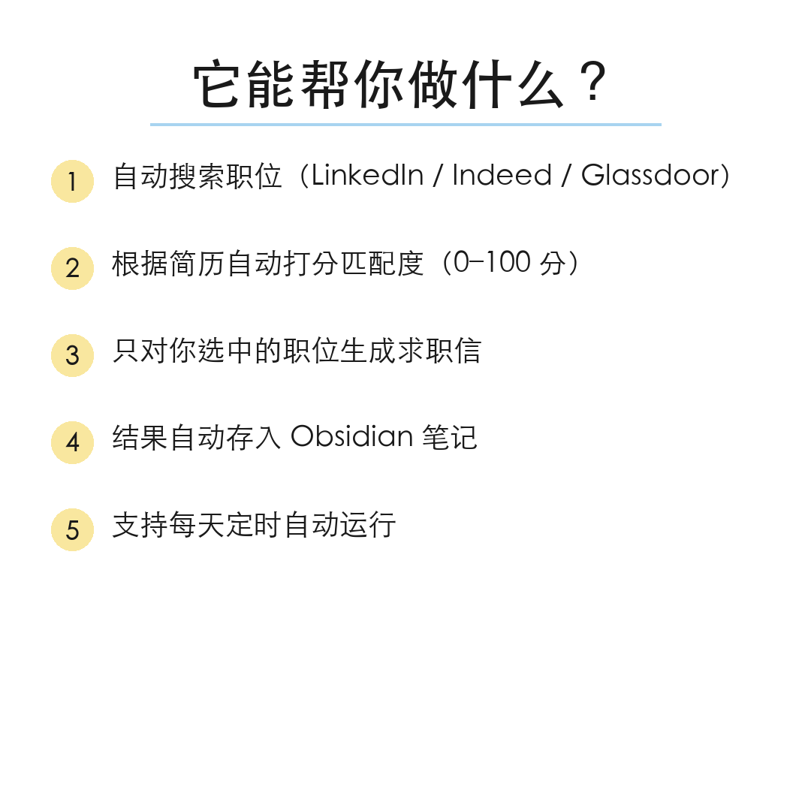
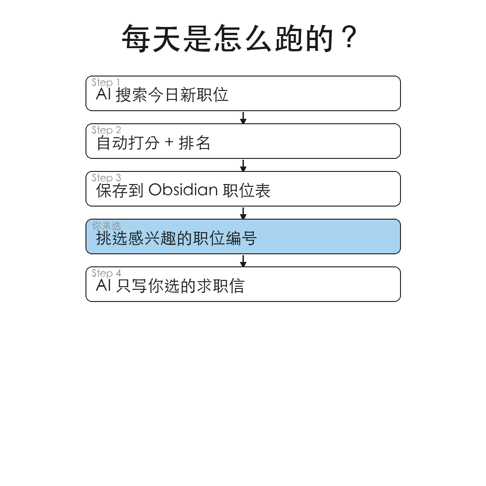
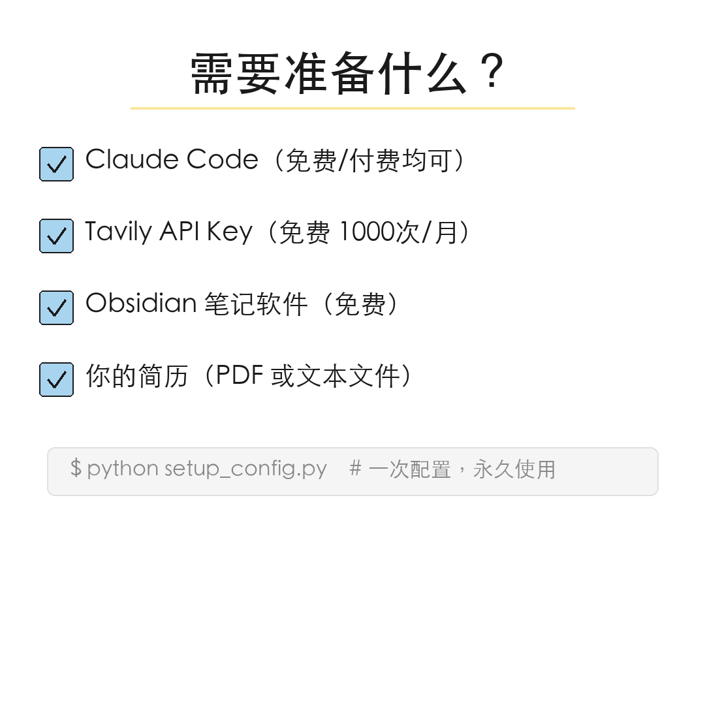
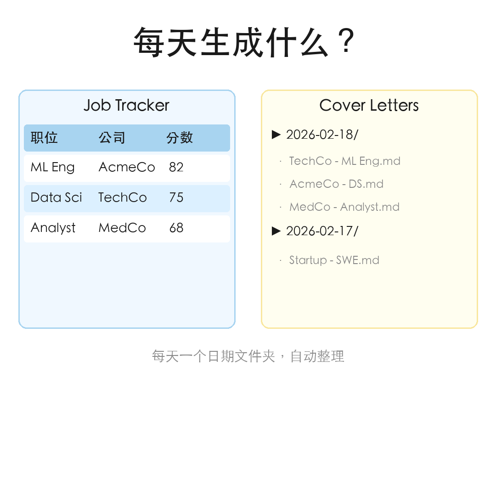

# Job Hunter Skill

Automates your job search by searching job postings via Tavily, matching them to your resume, generating cover letters, and organizing everything in Obsidian.

## Preview

<table>
  <tr>
    <td></td>
    <td></td>
    <td></td>
  </tr>
  <tr>
    <td></td>
    <td></td>
    <td></td>
  </tr>
</table>

## Quick Start

### First-Time Setup

1. **Set up virtual environment:**
   ```bash
   bash ~/.claude/skills/job-hunter/scripts/setup_venv.sh
   ```

2. **Configure Tavily API key and preferences:**
   ```bash
   ~/.venv/job-hunter/bin/python3 ~/.claude/skills/job-hunter/scripts/setup_config.py
   ```

3. **Set your resume path** (PDF or text file)

4. **Set Obsidian vault path**

### Usage

Run the job hunt:
```
/job-hunt
```

Or with specific options:
```
/job-hunt --keywords "software engineer" --location "San Francisco"
```

## Workflow

When invoked, the skill executes these steps:

### 1. Load Configuration
- Read config from `~/.config/job-hunter/config.json`
- Validate API keys and paths

### 2. Read Resume
- Load resume from configured path
- Extract key skills, experience, and preferences

### 3. Search Jobs (Tavily)
- Search each keyword via Tavily Search API with `time_range: "week"` (past 7 days)
- Target job boards: LinkedIn, Indeed, Glassdoor, Built In, Wellfound
- Uses `include_domains` to focus on job sites
- Each keyword search costs 1 Tavily credit (basic depth)
- Normalize and deduplicate results across keywords

### 4. Match Jobs
- Score each job against resume (0-100)
- Generate match reasons
- Rank by relevance

### 5. Save Job Tracker to Obsidian
- Write `Job Tracker - YYYY-MM-DD.md` to the Obsidian vault with **all** ranked jobs
- Do NOT overwrite an existing dated tracker file from a previous run
- Format as a numbered table with columns: `#`, `Score`, `Title`, `Company`, `Salary`, `Remote`, `Link`
- Sort by match score descending (highest first)

Example format:
```markdown
| # | Score | Title | Company | Salary | Remote | Link |
|---|-------|-------|---------|--------|--------|------|
| 1 | 55    | ML Engineer III | Acme Corp | - | Yes | [Apply](url) |
| 2 | 45    | EHR Data Analyst | Mass General Brigham | - | No | [Apply](url) |
```

### 6. Wait for User Selection — STOP HERE
After saving the tracker, tell the user:

> "Saved X jobs to **Job Tracker - YYYY-MM-DD.md** in Obsidian. Review the file and tell me which numbers you'd like cover letters for (e.g. '1, 3')."

**STOP. Do not generate any cover letters yet. Wait for the user to respond.**

> **Rule: Never auto-generate cover letters. Always wait for the user to select jobs by number after reviewing the Job Tracker file.**

### 7. Generate Selected Cover Letters Only
After the user responds with their selection (e.g. "1, 3"):

```bash
~/.venv/job-hunter/bin/python3 ~/.claude/skills/job-hunter/scripts/generate_cover_letters.py \
  --jobs /path/to/scored_jobs.json \
  --indices "1,3"
```

- `--indices` accepts comma-separated 1-based integers matching the `#` column in the tracker
- Only those specific cover letters are created in `Cover Letters/YYYY-MM-DD/`
- If `--indices` is omitted, falls back to `--top N` behavior (for automated/cron use)

## References

- [Tavily Setup Guide](references/tavily-setup.md) — API key setup, pricing, parameters, troubleshooting

## Configuration Reference

Config file: `~/.config/job-hunter/config.json`

```json
{
  "tavily_api_key": "tvly-xxx",
  "resume_path": "/path/to/resume.pdf",
  "obsidian_vault": "~/Documents/Obsidian Vault/job-hunter",
  "user_name": "Your Name",
  "search": {
    "keywords": ["machine learning engineer", "data scientist"],
    "location": "Boston, MA",
    "remote": true,
    "time_range": "week",
    "max_results_per_query": 20,
    "job_domains": ["linkedin.com/jobs", "indeed.com", "glassdoor.com"]
  }
}
```

### Key Fields

| Field | Description |
|-------|-------------|
| `tavily_api_key` | API key from https://app.tavily.com/home |
| `user_name` | Your name for cover letters |
| `search.time_range` | `"day"` = past 24h, `"week"` = past 7 days |
| `search.max_results_per_query` | Max 20 results per keyword (Tavily limit) |
| `search.job_domains` | Job sites to include in search |

## Scripts

- `scripts/tavily_scraper.py` - Searches jobs via Tavily Search API
- `scripts/run_search.py` - Search CLI entry point
- `scripts/score_jobs.py` - Score jobs against resume skills
- `scripts/generate_cover_letters.py` - Generate cover letters for top matches
- `scripts/setup_config.py` - Interactive configuration setup
- `scripts/daily_job_hunt.sh` - Full workflow orchestration (for cron)
- `scripts/setup_venv.sh` - Virtual environment setup
- `scripts/common/` - Shared modules (config, scoring, dedup, date utils)

## Obsidian Structure

```
job-hunter/
├── Job Tracker - 2025-01-27.md  # Today's tracker (dated per run day)
├── Job Tracker - 2025-01-26.md  # Previous day's tracker
├── Job Tracker.md               # Legacy tracker (still read for dedup)
├── Cover Letters/
│   ├── 2025-01-27/
│   │   ├── Company A - Role.md
│   │   └── Company B - Role.md
│   └── 2025-01-26/
└── Archive/
    └── 2025-01/                 # Archived by month
```

## Scheduling

For daily automated runs, add to crontab:
```bash
# Run job hunt daily at 10am
0 10 * * * bash ~/.claude/skills/job-hunter/scripts/daily_job_hunt.sh
```

## Credit Budget

Tavily free tier: 1000 credits/month
- Each keyword search = 1 credit (basic depth)
- 5 keywords/day x 30 days = 150 credits/month (well within limit)

## Troubleshooting

### Tavily API errors
- Verify API key is correct at https://app.tavily.com
- Check monthly credit usage (1000 free credits)
- Ensure `time_range` is one of: "day", "week", "month", "year"

### No jobs found
- Broaden search keywords
- Change `time_range` from "day" to "week"
- Add more domains to `job_domains`

### Virtual environment issues
- Re-run `bash ~/.claude/skills/job-hunter/scripts/setup_venv.sh`
- Ensure Python 3.10+ is installed
